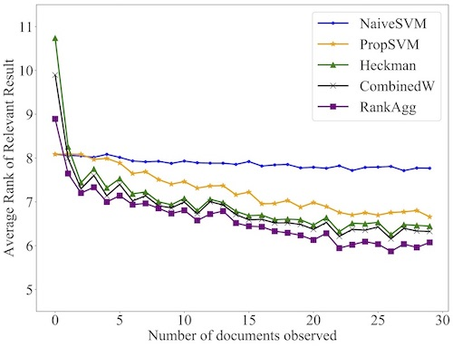

# HeckmanRank

## Requirements

- This project requires **python 3.6**
- Python package requiremnts is listed in **requirements.txt**
- Source dependencies are already included 
    - svm_proprank      [for Propensity SVM-Rank]
    - lib/pyrankagg     [for rank aggregation]
    - letor_metrics.py  [for evaluation metrics]


## Installation

- We highly recomment using virtual environment for this part of the project. To create a virtual environment with Anaconda, run the following:

    ```
    conda create -n heckman python=3.6
    ```

- Then activate the environment:

    ```
    conda activate heckman
    ```
    If you face issues with this command try:
    ```
    source activate heckman
    ```
- A build script is provided to help with installing dependencies. Execute the script as follows:

    ```
    sh build.sh
    ```

Following this should install all the dependencies. The python packages should be avaialable in the _heckman_ virtual environment. At this point you are ready to use the code.


## Usage

### Prerequisite

In order for the evaluation module to work correctly, it expects the generated data to be in certain format and located in a certain folder. Please refer to the readme under generation folder for the format. For evaluation, it requires the data to be placed under a folder named **generated_data** inside this evaluation module. It can be achieved in two ways:

1. After generating the data using the _generation_ module, copy/move the data into the folder ```evaluation/generated_data```
2. Keep the generated data as it is. Create a symbolic link to that data folder. The link name should be **generated_data**

```
ln -s <path_to_data_folder> generated_data
```

Make sure you either have a _folder_ or a _symbolic link_ named generated_data which contains all the data. After that, move forward with the experiments.

### Experiments

Assuming the data is generated in a proper format in pre-scpeified locations, running the experiment is straightforward. Execute the following command:

```
sh run.sh <eta> <passes> <cutoff>
```

The arguments are described as follows:

- \<eta> := position bias factor (0, 1.5, 2)
- \<passes> := number of sampling passes (5, 10, 15)
- \<cutoff> := selection bias cutoff (0, 1 ... 29)

For further understanding of the arguments please refer to the paper.

Here is two example runs:

```
sh run.sh 1 15 29
```

```
sh run.sh 1.5 15 29
```

**Note: For integer eta values, DO NOT pass decimal format arguments (1.0, 2.0 etc).

### Results

After the _run.sh_ executes succesfully, the results will be stored in **results** directory. and corresponding plots will be generated in **plots** directory. For example if you run the following command ```sh run.sh 1 15 29``` you should expect to see the following files: 

```
results/
│   15pass_eta1_combined_arrr.csv
|   15pass_eta1_combined_ndcg_10.csv
plots/
│   15pass_eta1_combined_arrr.eps
|   15pass_eta1_combined_ndcg_10.eps
```

Here is an example plot from the paper:

